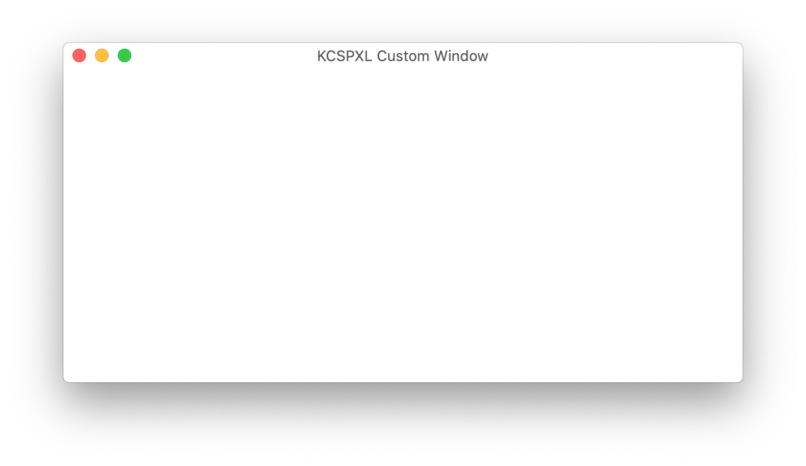

# KCSPXLCustomWindow

### Custom NSWindow Swift Package

1. Create a macOS project
2. Delete Window and ViewController from .xib
3. Add KCSPXLCustomWindow package
4. Add to `AppDelegate.swift` 

`lazy var kcsplWindowController = KCSPXLCustomWindowWindowController()`

5. Add to `func applicationDidFinishLaunching(_ aNotification: Notification)`
        // Remove the white background test ViewController 
        `kcspxlCustomWindowController.changeViewControllerRequired(isRequired: false)`
        `kcspxlWindowController.showWindow(nil)`
		

Options:
- `changeIsViewControllerRequired` - you can add your custom NSViewController to the new window by removing the test ViewController
- `changeCustomWindowSize` - you can add the width and height of the new window
- `chnageIsTitleRequired` - you can remove the title of the NSWindow
- `changeWindowTitle` - you can replace the default title

